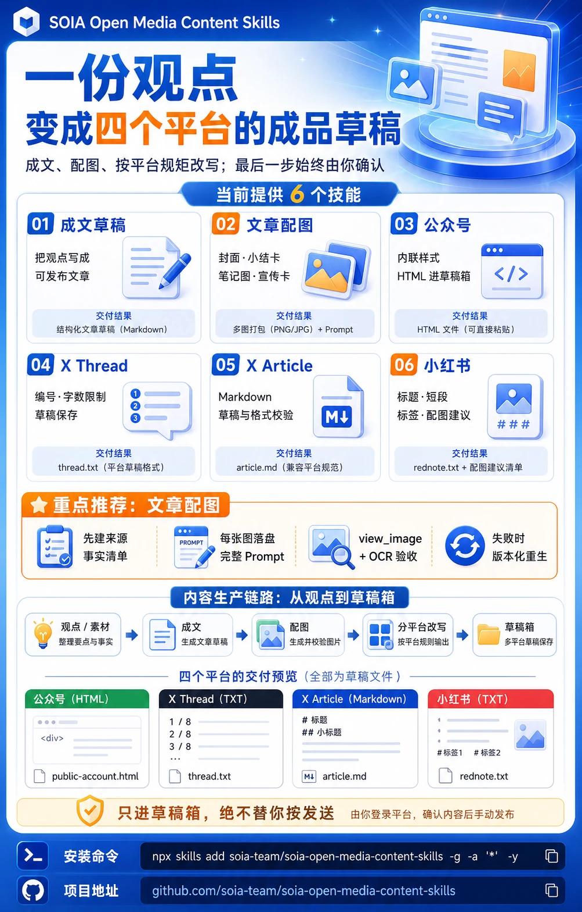
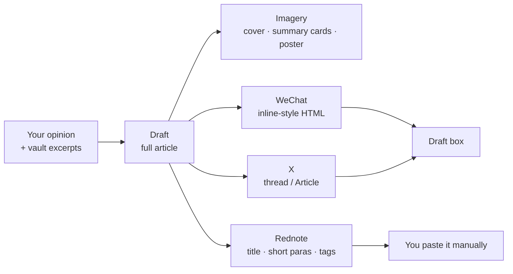

<div align="center">



# SOIA Open Media Content Skills

**One draft, adapted for three platforms — you always press publish**

6 skills for drafting, imagery and per-platform adaptation. Drafts only, never an automatic broadcast

[中文](README.md) · English · [Ecosystem portal](https://github.com/soia-team/soia-open-skills)

</div>

---

## What it solves

You finish a piece, and then WeChat wants inline styles, Rednote wants short paragraphs with topic tags, X wants numbered parts — the same content reworked three times by hand. What's missing is **a pipeline from opinion to per-platform drafts**, not a bot that presses publish for you.



## 6 skills

### 01 Drafting and imagery　`Opinion and material → a full draft plus visuals`

| Skill | Responsibility | Ready |
|---|---|:-:|
| `soia-media-compose-article-draft` | Writes a full draft with your opinion as the spine and vault excerpts as material; WeChat / Zhihu / essay styles | ✅ |
| `soia-media-generate-article-image` | Covers, summary cards, Cornell-notes images and metaphor posters, with prompt provenance and bitmap acceptance | 🟡 |

### 02 Adaptation and drafts　`One draft → publish-ready on three platforms`

| Skill | Responsibility | Ready |
|---|---|:-:|
| `soia-media-publish-wechat-draft` | Formats to WeChat-compliant inline-style HTML, mechanically validated before entering the draft box | 🟡 |
| `soia-media-publish-rednote-card` | Rewrites into a Rednote note: catchy title, 3–5 short paragraphs, topic tags, image suggestions | ✅ |
| `soia-media-publish-x-thread` | Rewrites into a numbered, length-compliant X thread; saves a draft when authorized | 🟡 |
| `soia-media-publish-x-article` | Uploads a Markdown piece to the X Articles draft box and validates the format | 🟡 |

✅ Works right after install　🟡 Needs platform authorization or an API key first; the skill tells you what is missing before it runs

## Install

Any of three hosts. Installing the domain plugin brings all 6 skills at once.

```bash
claude plugin marketplace add soia-team/soia-open-skills && claude plugin install soia-media-content@soia
```

```bash
codex plugin marketplace add soia-team/soia-open-skills && codex plugin add soia-media-content@soia
```

WorkBuddy is a desktop app with no CLI, so a skill does the work — tell your agent "install into WorkBuddy", or run:

```bash
python3 <soia-open-skills>/skills/soia-meta-skill-release/scripts/install_workbuddy_experts.py soia-media-content
```

Restart the client, then summon **Soia · 新媒体运营** under Experts → My Experts.

> **Always-on cost ~728 tok**. `claude plugin disable soia-media-content@soia` drops it to zero; enable it again any time.
> For a single skill use npx: `npx skills add soia-team/soia-open-media-content-skills -g -a '*' -s <skill-name> -y` — pick one route or the other; running both puts the same skill in the index twice and the copies drift apart.

## What it does not do

This is the most important section in this repo — read it before using anything here.

- **Never publishes automatically.** WeChat gets a draft and **never a broadcast**; X gets a saved draft, never a post; Rednote gets text you paste yourself. This is a hard boundary — urgency does not move it, and blanket pre-authorization ("just stop asking me") is not accepted.
- **Does not write your opinions.** The skills organize expression; they do not manufacture a position. If you cannot articulate one, distill it first in the [vault domain](https://github.com/soia-team/soia-open-pkm-vault-skills).
- **Does not invent facts on images.** Before generating, it lists the facts that will appear and checks them with you.
- **Does not store platform credentials.** WeChat and X sessions stay in their official flows — never in the repo or the logs.

## Contributing

Before committing a skill change:

```bash
python3 -m unittest discover -s tests -p 'test_*.py' && python3 scripts/audit_skills.py --strict && python3 scripts/generate_expert_manifest.py --check
```

Full workflow in the portal's [CONTRIBUTING.md](https://github.com/soia-team/soia-open-skills/blob/main/CONTRIBUTING.md).

## License

MIT — see [LICENSE](./LICENSE).
