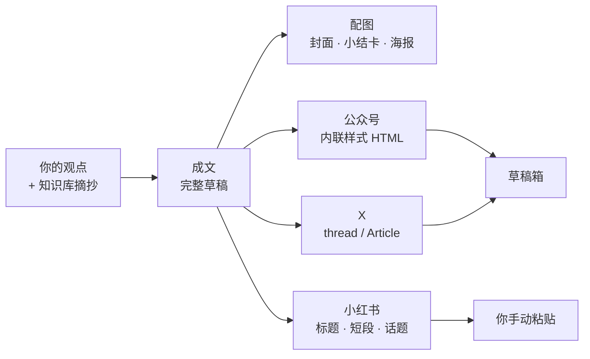

<div align="center">


# SOIA Open Media Content Skills

**一篇成文，改写成三个平台——发布键永远由你按**

6 个技能覆盖成文、配图与多平台改写；只建草稿，绝不自动群发

[English](README.en.md) · 中文 · [全生态门户](https://github.com/soia-team/soia-open-skills)

</div>

---

## 它解决什么

写完一篇，公众号要内联样式、小红书要短段加话题、X 要分条编号——同一份内容手工返工三遍。缺的是**一条从观点到各平台草稿的流水线**，而不是一个替你点发布的机器人。



## 6 个技能

### 01 成文与配图　`观点与素材 → 成文草稿 + 视觉产物`

| 技能 | 职责 | 开箱 |
|---|---|:-:|
| `soia-media-compose-article-draft` | 以你的观点为骨、vault 摘抄为料写成完整草稿；可指定公众号/知乎/随笔风格 | ✅ |
| `soia-media-generate-article-image` | 生成封面、正文小结卡、康奈尔笔记图或视觉隐喻海报，含 Prompt 落盘与位图验收 | 🟡 |

### 02 平台改写与落草稿　`一份成文 → 三平台可发状态`

| 技能 | 职责 | 开箱 |
|---|---|:-:|
| `soia-media-publish-wechat-draft` | 排版成符合公众号限制的内联样式 HTML，机械校验通过后推入草稿箱 | 🟡 |
| `soia-media-publish-rednote-card` | 改写成小红书笔记：吸睛标题、3–5 段短文、话题标签与配图建议 | ✅ |
| `soia-media-publish-x-thread` | 改写为带编号、符合字数限制的 X thread，可按授权存草稿 | 🟡 |
| `soia-media-publish-x-article` | 把 Markdown 成文上传到 X Articles 草稿箱并校验格式 | 🟡 |

✅ 装完即用　🟡 需先完成平台授权或申请 API key，技能会在执行前告诉你缺什么

## 安装

三个宿主任选，装整个领域插件即 6 个技能一次到位。

```bash
claude plugin marketplace add soia-team/soia-open-skills && claude plugin install soia-media-content@soia
```

```bash
codex plugin marketplace add soia-team/soia-open-skills && codex plugin add soia-media-content@soia
```

WorkBuddy 是桌面端没有 CLI，由技能代劳——对 AI 说「装到 WorkBuddy」，或直接跑：

```bash
python3 <soia-open-skills>/skills/soia-meta-skill-release/scripts/install_workbuddy_experts.py soia-media-content
```

装完重启客户端，在【专家中心 → 我的专家】召唤 **Soia · 新媒体运营**。

> **常驻成本 ~728 tok**。不用时 `claude plugin disable soia-media-content@soia` 降到零，随时开回来。
> 只想要单个技能可走 npx：`npx skills add soia-team/soia-open-media-content-skills -g -a '*' -s <技能名> -y`——与插件二选一，并存会产生双份索引且各自漂移。

## 不负责什么

这一节是本仓最重要的部分，请读完再用：

- **绝不自动发布**。公众号只建草稿**绝不群发**；X 只存草稿不点发布；小红书只产文本由你手动贴。这是硬边界，催也不越线，也不接受「以后都不用问我」这类预授权。
- **不代写观点**。技能组织表达，不生产立场。说不出观点时先去 [知识库](https://github.com/soia-team/soia-open-pkm-vault-skills) 做提炼，而不是让 AI 替你编一个。
- **不编造图上的事实**。配图前先列事实清单跟你核对。
- **不保存平台凭据**。公众号、X 的登录态与授权由官方流程持有，不进仓库、不进日志。

## 贡献

改动技能后提交前跑：

```bash
python3 -m unittest discover -s tests -p 'test_*.py' && python3 scripts/audit_skills.py --strict && python3 scripts/generate_expert_manifest.py --check
```

完整流程见门户仓 [CONTRIBUTING.md](https://github.com/soia-team/soia-open-skills/blob/main/CONTRIBUTING.md)。

## License

MIT —— 见 [LICENSE](./LICENSE)。
